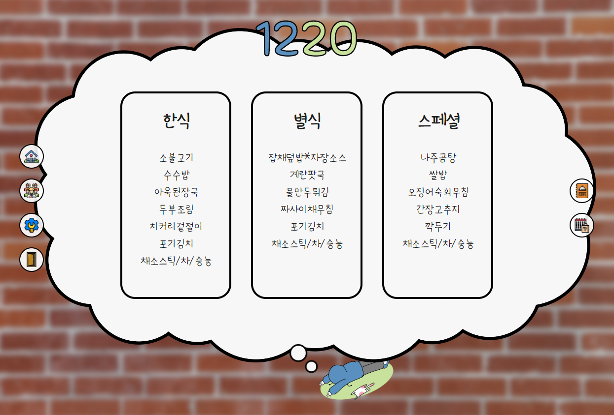
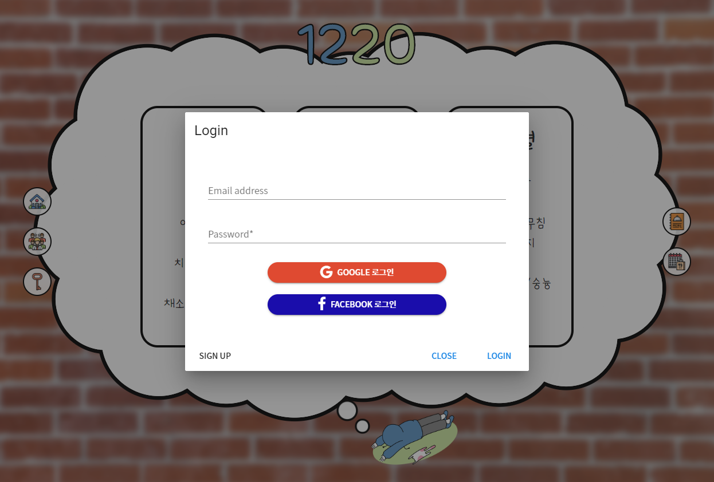
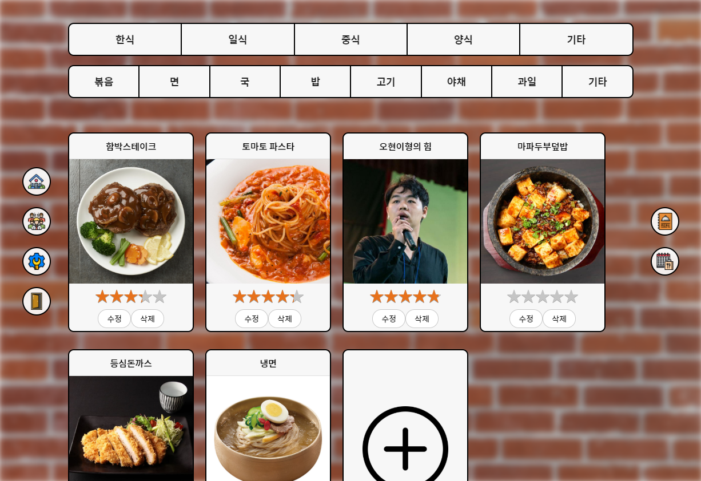
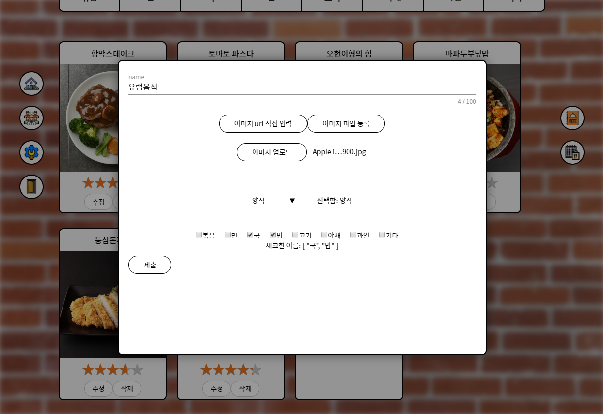
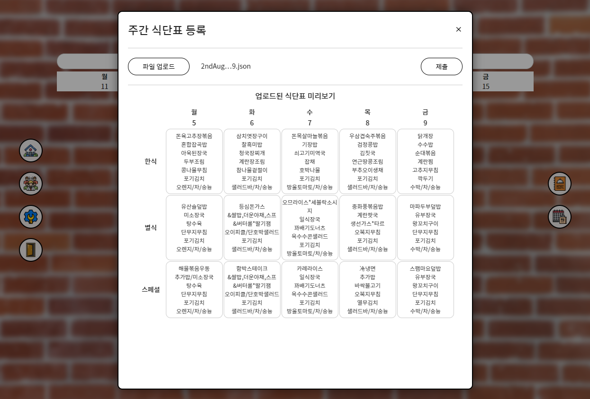
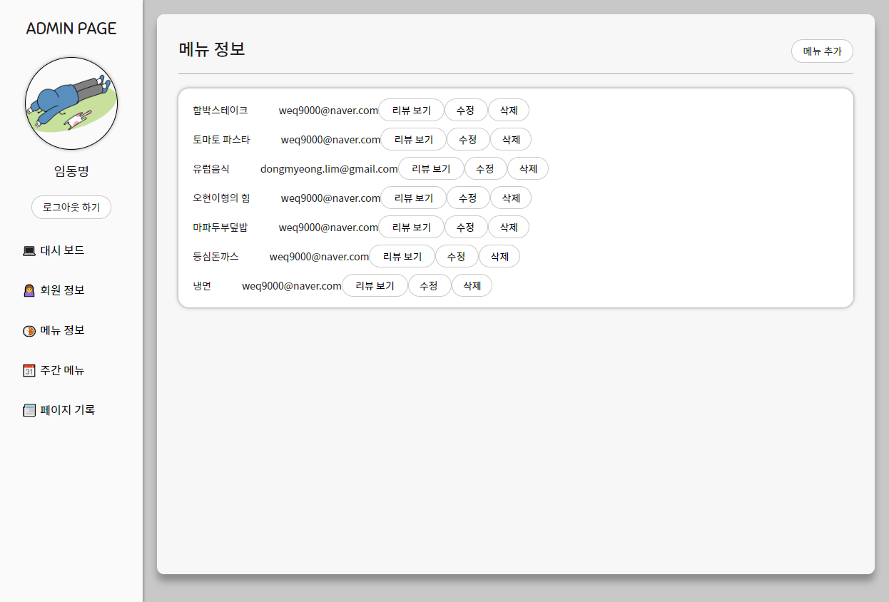
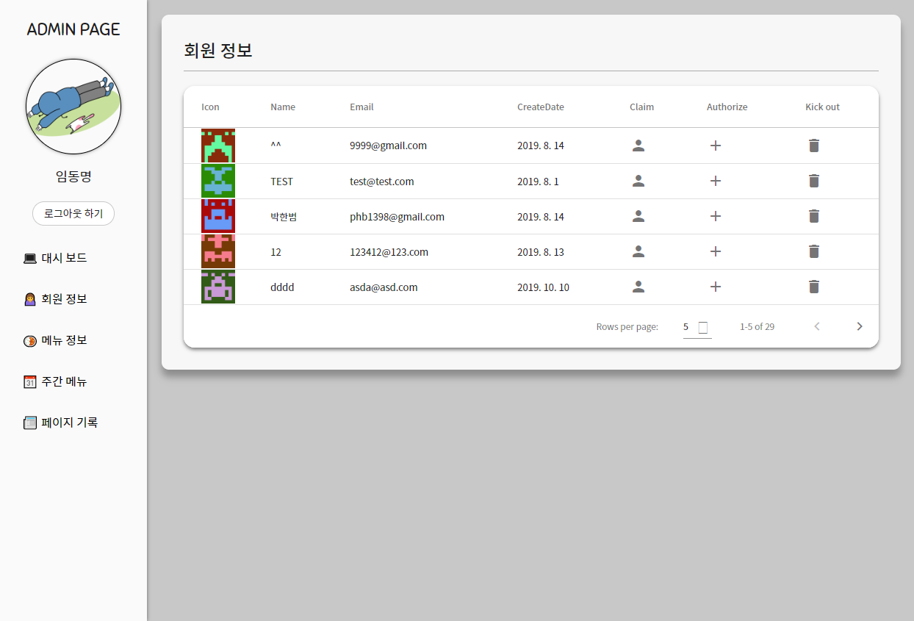

# 메뉴 평가 사이트

> 삼성 연수원 점심 메뉴에 대한 정보와 후기를 남기는 사이트를 제작하였습니다.
>
> 삼성 청년 소프트웨어 아카데미에서 제공한 코드를 일부 이용하였습니다.

firebase를 이용하여 배포하였습니다.

주소 : https://spatial-framing-246206.web.app/ 


## Install

```bash
$ npm install
$ npm run serve
```


## 개발 환경

기술 스택 : Node.js, Vue.js, Firebase, Sass

버전 관리 : Git

이슈 관리 : Jira

소통 : Telegram


## 팀 구성

#### 총 5명 (프론트엔드 3명, 백엔드 1명, PWA 1명)

###### 본인 : 프론트엔드 겸 조장


## 개발 내용

> 직접 개발한 내용만 코드를 첨부하였습니다.

#### 폴더 구조

components와 view로 나누어 폴더 구조가 복잡해지지 않도록 하였고, 파일명이나 폴더명에 규칙을 정해 협업이 용이하도록 하였습니다.

```bash
> src
	> assets
		> images
		...
	> components
		> admin
		> mainview
		> post
		...
	> data
		2ndAug2019.json
		...
	> services
		...
	> views
		AdminPage.vue
		AdminPage.scss
		...
	App.vue
	main.js
	...
```


#### 메인 페이지

오늘의 메뉴가 표시됩니다. SVG와 CSS의 애니메이션 속성을 이용하여 구름이 움직이는 듯한 효과를 주었습니다.



```html
<div class="section-1-content-menu">
    <!-- for shadow -->
    <div class="section-1-ball-container" style="z-index: -2;">
        <div v-for="i in 20" :key="i" :class="'ball'+i" style="box-shadow: 0 0 0 5px black; z-index: -1;"/>
    </div>
    <div class="section-1-ball-container" style="z-index: -1">
        <div v-for="i in 20" :key="i" :class="'ball'+i"/>
    </div>
    <svg version="1.1" x="0px" y="0px" viewBox="0 0 760 350" style="enable-background:new 0 0 760 350;">
        <path style="fill:#f7f7f7;" d="M380,14.6C85.4,14.6,40.4,8.7,31.6,169.5v5.5  c0,0,0,5.5,0,5.5C40.4,341.3,85.4,335.4,380,335.4s339.6,5.9,348.4-154.9c0,0,0-5.5,0-5.5v-5.5C719.6,8.7,674.6,14.6,380,14.6z"/>
    </svg>
...
</div>
```

```scss
@mixin circle($mod) {
    position: absolute;
    // top: 10%;
    // left: 10%;
    // border: 2px solid black;
    // width: 100px;
    // height: 100px;
    background: #f7f7f7;
    border-radius: 50%;
    z-index: 2;

    offset-path: path('M380,14.6C85.4,14.6,40.4,8.7,31.6,169.5v5.5  c0,0,0,5.5,0,5.5C40.4,341.3,85.4,335.4,380,335.4s339.6,5.9,348.4-154.9c0,0,0-5.5,0-5.5v-5.5C719.6,8.7,674.6,14.6,380,14.6z');
    offset-distance: 0%;

    animation: $mod 200s linear infinite;
}
@for $i from 1 through 20 {
    .ball#{$i} {
        @include circle("ball#{$i}");
    }
}
.ball1, .ball3, .ball7, .ball11, .ball13, .ball17, .ball20 {
    height: 16vh;
    width: 16vh;
    // width: 120px;
    // height: 120px;
}
.ball2, .ball5, .ball8, .ball12, .ball14, .ball15, .ball18, .ball19 {
    height: 18vh;
    width: 18vh;
}
.ball4, .ball6, .ball9, .ball10, .ball16 {
    height: 22vh;
    width: 22vh;
}
@for $i from 1 through 20 {
    @keyframes ball#{$i} {
        from {offset-distance: 0 + $i*5%}
        to {offset-distance: 100 + $i*5%}
    }
}
```


#### 구글 로그인(백엔드)




#### 페이지 단위 스크롤

vue와 javascript를 이용해 휠을 사용할시 한페이지 단위로 페이지가 움직이도록 구성하였습니다.

```js
mounted() {
    window.addEventListener('wheel', this.pageScroll)
    team_btn.addEventListener('click', this.pageScroll)
},
methods: {
	pageScroll(e) {
        // console.log('pageScroll activated', this.timer)
        if (!this.timer) {
            let y = e.deltaY
            let h = window.innerHeight
            // console.log('pageScroll if 문', this.timer, y, h)
            if (y > 0 || !y)  window.scrollBy(0, h)
            else        window.scrollBy(0, -h)
            this.timer = setTimeout(() => {
                this.timer = null
            }, 500)
        }
    },
}
```


#### 메뉴 페이지

위의 버튼으로 메뉴를 필터링 할 수 있습니다.

음식 사진 마지막의 +를 눌러 메뉴를 추가할 수 있습니다.






#### 월 식단표 추가

json형태의 식단표 파일이 있다면 다음과 같이 나타냅니다.




#### 관리자 페이지

회원 정보와 메뉴 정보를 볼 수 있습니다.



```html
<template>
    <div style="height: 100%; width: 100%;">
        <div class="main-wrapper">
            <!-- 로그인된 상태 (관리자) -->
            <AdminPageView v-if="($store.state.admin===true)"/>
            <!-- 로그인된 상태 (일반회원) -->
            <div v-if="$store.state.admin===false" class="admin-login">
                <div class="admin-login-box">
                    <div class="admin-login-title">
                        관리자 계정이 아닙니다!
                    </div>
                    <div class="admin-login-content">
                        <v-btn @click="signOut">Logout</v-btn>
                    </div>
                </div>
            </div>           
            <div v-if="$store.state.admin===''" class="admin-login">
                <div class="admin-login-box">
                    <div class="admin-login-title">
                        관리자 계정으로 로그인하세요.
                    </div>
                    <div class="admin-login-content">
                        <LoginModal/>
                    </div>
                </div>
            </div>
            <!-- 유저 리스트가 나오는 영역 임시로 v-bind:members="members" member="member" -->
            <component v-bind:is="Compo" >
            </component>
        </div>
    </div>
</template>
```

